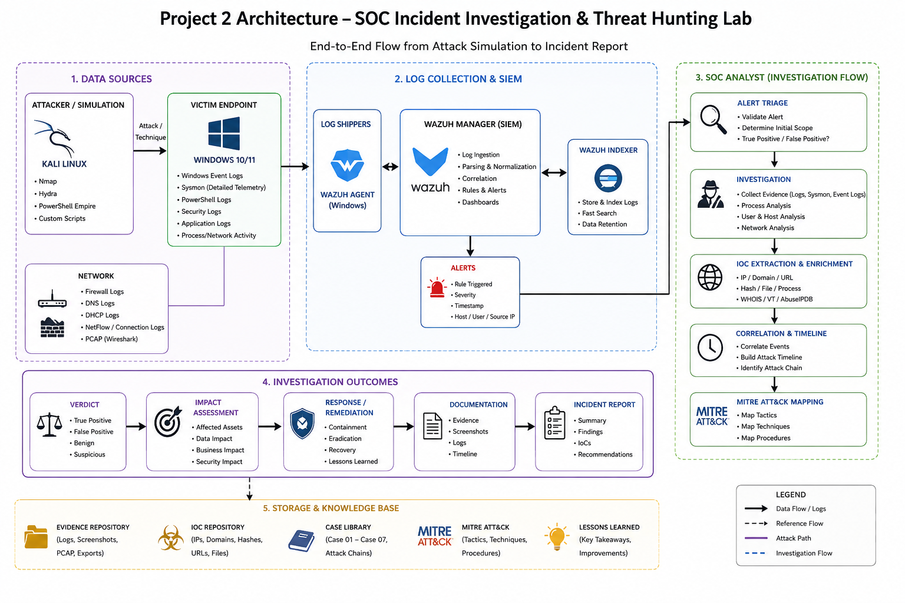
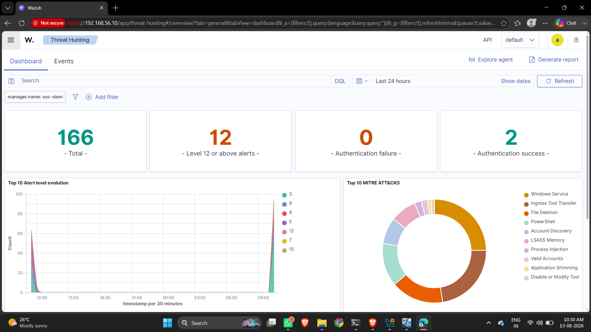
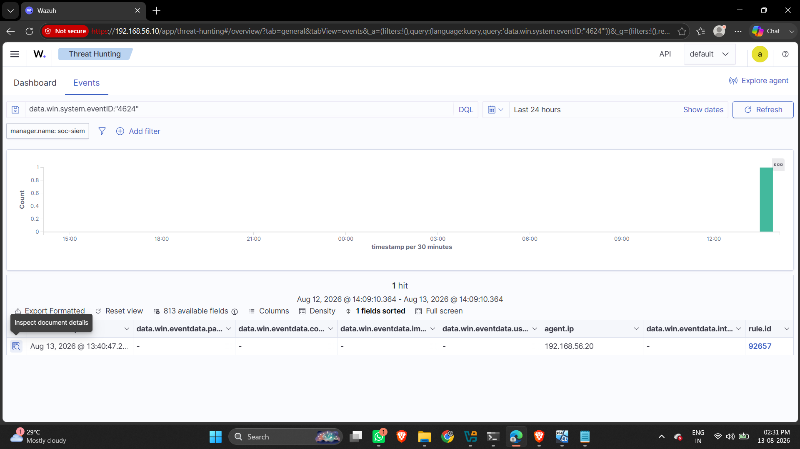

# SOC Incident Investigation & Threat Hunting Lab

> **Recruiter Presentation Layer** — Hands-on Security Operations Center (SOC) investigation, evidence analysis, SIEM telemetry correlation, and hypothesis-driven threat hunting in a dedicated laboratory environment.

---

## 1. What I Built

I built and operated a **hands-on Windows SOC Incident Investigation & Threat Hunting Laboratory**. The environment was designed to simulate realistic security incidents, collect multi-source endpoint and network telemetry, perform analyst-driven triage and evidence correlation, and map observed attacker behaviors against the **MITRE ATT&CK** framework.

The project demonstrates the complete end-to-end SOC investigation lifecycle:

```text
  Alert Triage
       │
       ▼
  Evidence Collection ──► (Sysmon, Windows Events, Wazuh SIEM, Wireshark)
       │
       ▼
  IOC Extraction ────────► (IPs, User Accounts, Process GUIDs, Command Lines)
       │
       ▼
  Timeline Reconstruction
       │
       ▼
  Telemetry Correlation
       │
       ▼
  MITRE ATT&CK Mapping
       │
       ▼
  Verdict Classification ─► (Benign, Suspicious, Confirmed Persistence, Multi-Stage Simulation)
       │
       ▼
  Impact Assessment & Recommendations
```

---

## 2. Why I Built It

Modern SOC analysis requires more than viewing alerts on a dashboard—it demands deep investigation into endpoint telemetry, process lineage, authentication patterns, packet captures, and evidence-based reasoning. I created this lab to:
- **Master Multi-Source Telemetry Correlation**: Validate how Sysmon Event ID 1 (Process Creation), Event ID 3 (Network Connection), Windows Event ID 4625 (Failed Logon), and Event ID 4624 (Successful Logon) correlate inside **Wazuh SIEM**.
- **Practice Evidence-Based Triage**: Develop strict analyst discipline—distinguishing benign test/admin activity from suspicious execution and confirmed compromise without relying on assumptions.
- **Deep-Dive Network Packet Analysis**: Perform independent network packet inspection using **Wireshark** to corroborate endpoint network telemetry.
- **Apply MITRE ATT&CK**: Map observed host and network behavior directly to MITRE techniques based strictly on empirical evidence.
- **Produce Recruiter-Grade SOC Reports**: Document investigation workflows, indicators of compromise (IOCs), process ancestry, and actionable response recommendations.

---

## 3. Lab Architecture

The lab operates on an isolated virtual network (`192.168.56.0/24`):



```text
                               SOC Investigation Lab

                                    ┌─────────────┐
                                    │ Kali Linux  │ (Attacker / Test Host)
                                    │192.168.56.101
                                    └──────┬──────┘
                                           │
                                    Lab Network (192.168.56.0/24)
                                           │
                                           ▼
┌─────────────────────┐             ┌──────────────┐
│ Windows 11 Victim   │             │   Wireshark  │
│ 192.168.56.20       │────────────►│ Packet       │ (Network Packet Capture)
│                     │             │ Analysis     │
│ Windows Event Logs  │             └──────────────┘
│ Sysmon Operational  │
│ PowerShell Logs     │
└──────────┬──────────┘
           │
           │ Endpoint Telemetry (Wazuh Agent)
           ▼
      ┌──────────┐
      │  Wazuh   │
      │   SIEM   │ (SIEM Centralized Logging & Alerting)
      └────┬─────┘
           │
           ▼
     SOC Analyst Investigation
           ├── IOC Analysis
           ├── Timeline Reconstruction
           ├── MITRE ATT&CK Mapping
           └── Structured Incident Reports
```

### Core Lab Components:
- **Windows 11 Victim Endpoint (`192.168.56.20`)**: Primary monitored endpoint instrumented with Sysmon and forwarding events to Wazuh Manager.
- **Kali Linux (`192.168.56.101`)**: Controlled testing host generating authentication attempts and network traffic.
- **Wazuh SIEM Manager & Dashboard**: Centralized logging, detection rule evaluation, and security event visualization.
- **Wireshark**: Packet-level capture and TCP/HTTP protocol analysis.

---

## 4. Tools & Technologies Used

| Category | Tools / Technologies | Purpose in Lab |
|---|---|---|
| **SIEM & Monitoring** | Wazuh SIEM Manager & Dashboard | Centralized log ingestion, alerting, DQL threat hunting |
| **Endpoint Telemetry** | Sysmon (System Monitor), Windows Event Log | Process creation (Event ID 1), Network connections (Event ID 3), Authentication (4625 / 4624) |
| **Network Analysis** | Wireshark, Nmap | Packet-level TCP/HTTP analysis, open port verification |
| **Attack Simulation** | Kali Linux, SMB/Net.exe, PowerShell, cmdkey, Task Scheduler | Controlled scenario generation for authentication, execution, discovery, and persistence |
| **Frameworks** | MITRE ATT&CK Framework | Mapping techniques (T1110, T1059.001, T1555.004, T1053.005, T1059.003) |
| **Investigation** | PowerShell (`Get-WinEvent`), DQL (Dashboard Query Language) | Command-line threat hunting and log correlation |

---

## 5. Summary of Investigations Performed

I investigated **6 structured SOC cases** within the lab environment:

| Case ID | Investigation Title | Key Telemetry / Event ID | Verdict |
|---|---|---|---|
| **[Case 01](./cases/case-01-brute-force.md)** | Brute-Force Authentication | Event 4625 (Failed) & Event 4624 (Success), NTLM | **Suspicious Authentication Pattern** (5 failed logons followed by successful logon over SMB) |
| **[Case 02](./cases/case-02-powershell.md)** | Suspicious PowerShell Execution | Sysmon Event ID 1 (`powershell.exe -ExecutionPolicy Bypass`) | **Suspicious Execution Flag / Benign Payload** (`Write-Output` test marker) |
| **[Case 03](./cases/case-03-network.md)** | Network Investigation | Sysmon Event ID 3 (`192.168.56.20` -> `192.168.56.101:8080`), Wireshark | **Benign Controlled Network Traffic** (HTTP test server) |
| **[Case 04](./cases/case-04-credential-access.md)** | Credential Access Behavior | Sysmon Event ID 1 (`cmdkey.exe /list` PID 532 under `SOC-WIN11`) | **Suspicious Discovery / Theft Not Confirmed** (Credential Manager enumeration) |
| **[Case 05](./cases/case-05-persistence.md)** | Scheduled Task Persistence | Scheduled Task `SOC-CASE-05-Persistence`, Sysmon Event ID 1 (`svchost.exe` parent), Wazuh Rule 92052 | **Confirmed Persistence Mechanism** (Harmless `cmd.exe /c echo` test payload) |
| **[Case 06](./cases/case-06-attack-chain.md)** | Full Attack Chain | Cross-case master timeline & multi-telemetry correlation | **Controlled Multi-Stage Simulation** (Host correlation verified across lab phases) |

---

## 6. Key Evidence Highlights

### Wazuh SIEM Visibility


### Case 01: Authentication Evidence (4625 -> 4624)


### Case 04: Sysmon Credential Access (`cmdkey.exe /list`)


### Case 05: Task Scheduler Persistence in Sysmon (`svchost.exe` Parent)


---

## 7. SOC Investigation Methodology

Every case in this lab followed a 12-step structured analyst workflow:

1. **Alert Triage**: Identify source, severity, host (`WIN11-CLIENT`), IP (`192.168.56.20`), user account, and initial indicator.
2. **Evidence Collection**: Query Windows Security Logs, Sysmon Operational Logs, Wazuh archives, and Wireshark pcaps.
3. **IOC Extraction**: Extract validated IP addresses (`192.168.56.101`), user accounts (`soc-test`, `SOC-WIN11`), PIDs, Process GUIDs, and command lines.
4. **Timeline Construction**: Normalize timestamps into chronological sequences.
5. **Telemetry Correlation**: Match endpoint process events (Sysmon ID 1) with SIEM events and network packets (Wireshark).
6. **Process Analysis**: Inspect parent-child process chains (`powershell.exe` -> `cmdkey.exe`, `svchost.exe` -> `cmd.exe`), integrity levels, and image paths.
7. **Network Analysis**: Examine TCP/HTTP traffic, source/destination IPs, and port numbers (`8080`, `445`).
8. **MITRE ATT&CK Mapping**: Assign techniques based strictly on empirical evidence.
9. **Verdict Classification**: Categorize verdict (Benign, False Positive, Suspicious, True Positive, Confirmed Compromise).
10. **Impact Assessment**: Evaluate account compromise, privilege escalation, persistence, or data exfiltration.
11. **Response Recommendations**: Formulate actionable containment, eradication, and monitoring strategies.
12. **Investigation Closure**: Compile findings into a structured report distinguishing *observed facts* from *unsupported assumptions*.

---

## 8. MITRE ATT&CK Mapping Summary

| Technique ID | Technique Name | Case Mapping | Observed Evidence |
|---|---|---|---|
| **T1110 / T1110.001** | Brute Force: Password Guessing | Case 01 | 5 failed logons (Event 4625) followed by successful logon (Event 4624) for `soc-test` |
| **T1059.001** | Command and Scripting Interpreter: PowerShell | Case 02, Case 04 | Execution of `powershell.exe` with `-ExecutionPolicy Bypass` and launching `cmdkey.exe` |
| **T1555.004** | Credentials from Password Stores: Windows Credential Manager | Case 04 | Execution of `"cmdkey.exe" /list` (PID 532) to enumerate Windows Credential Manager |
| **T1053.005** | Scheduled Task/Job: Scheduled Task | Case 05 | Creation and execution of task `SOC-CASE-05-Persistence` configured at logon |
| **T1059.003** | Command and Scripting Interpreter: Windows Command Shell | Case 05 | `cmd.exe` spawned by `svchost.exe -k netsvcs -p -s Schedule` (Wazuh Rule 92052) |

Full mapping documentation is available in **[mitre/ATTACK-Mapping.md](./mitre/ATTACK-Mapping.md)**.

---

## 9. Threat Hunting Overview

Threat hunting queries were authored and executed across **PowerShell**, **Wazuh DQL**, and **Wireshark**:

- **Authentication Hunting**: `Get-WinEvent -FilterHashtable @{LogName='Security'; Id=4625}` & `Id=4624`
- **Process Creation Hunting**: `Get-WinEvent -FilterHashtable @{LogName='Microsoft-Windows-Sysmon/Operational'; Id=1}` searching for `powershell.exe`, `-ExecutionPolicy Bypass`, and `cmdkey.exe /list`
- **Persistence Hunting**: `schtasks.exe /Query /TN "SOC-CASE-05-Persistence" /V /FO LIST` and filtering Sysmon Event 1 for parent `svchost.exe -s Schedule`
- **Network Hunting**: Sysmon Event ID 3 filtering `destinationIp:"192.168.56.101"` and Wireshark display filter `ip.addr == 192.168.56.101 && tcp.port == 8080`

Full query library is available in **[threat-hunting/Queries.md](./threat-hunting/Queries.md)**.

---

## 10. Key Skills Demonstrated

- **Windows Telemetry Mastery**: Deep knowledge of Windows Security events (4625, 4624) and Sysmon process telemetry (Event ID 1, 3).
- **SIEM Operations**: Ingesting, parsing, searching, and building queries in Wazuh SIEM.
- **Process Lineage & Parent-Child Analysis**: Utilizing Process ID, Parent Process ID, Process GUID, and image paths to trace execution context.
- **Network Protocol Analysis**: Capturing and analyzing TCP/HTTP traffic in Wireshark to validate endpoint connection logs.
- **Hypothesis-Driven Threat Hunting**: Formulating targeted queries to uncover hidden or un-alerted endpoint activity.
- **Strict Analyst Discipline**: Resisting the urge to over-classify benign test activity while rigorously documenting true security risks.

---

## 11. Lessons Learned

1. **Correlation Requires Identical Context**: Events on the same host cannot be assumed to be part of the same attack chain unless correlated by timestamp, user context, process GUID, or network tuple.
2. **Execution Flags != Malicious Payload**: Flags like `-ExecutionPolicy Bypass` indicate security-relevant execution characteristics, but analyst verification of command-line arguments is required to determine true intent.
3. **Task Scheduler Parent Lineage**: Commands launched via Scheduled Tasks display `svchost.exe -k netsvcs -p -s Schedule` as their parent process in Sysmon Event ID 1.
4. **SIEM Telemetry Gaps**: Sysmon events generated locally may not always appear in SIEM dashboards if Wazuh agent rules or eventchannel configurations lack specific mapping rules. Local endpoint log inspection remains vital.

---

## 12. Technical Repository Link

Complete evidence, configuration files, and raw log artifacts are maintained in the primary technical repository:

🔗 **GitHub Repository**: [SOC Incident Investigation & Threat Hunting Lab](https://github.com/Krishnagurme/Soc-incident-investigation-threat-hunting.git)
