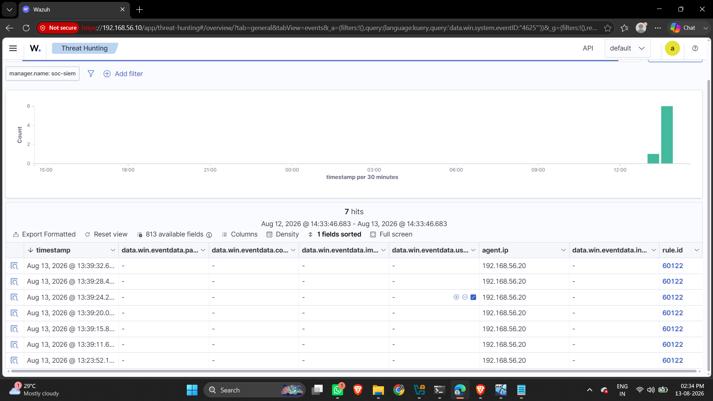
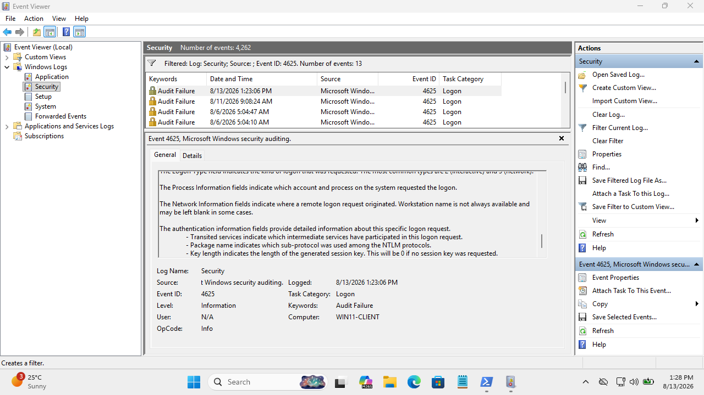
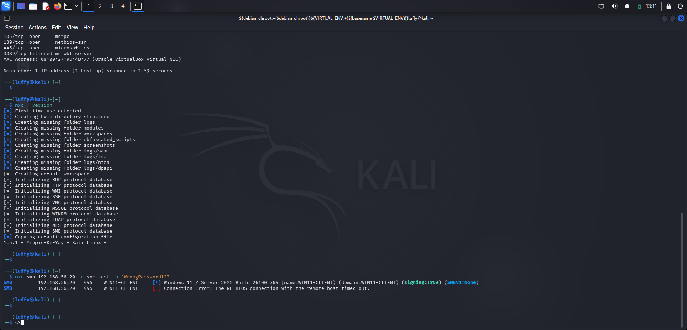

# Case 01 — Brute-Force Authentication Investigation

## Case Metadata
- **Case ID**: CASE-001
- **Status**: Closed — Investigation Completed
- **Date**: 2026-08-13
- **Initial Alert Source**: Wazuh Dashboard
- **Alert Description**: Multiple failed logons followed by successful logon
- **Initial Severity**: Medium (Audit Failure / Authentication Anomaly)

---

## Affected Asset & User Context
- **Host Name**: `WIN11-CLIENT`
- **Host IP Address**: `192.168.56.20`
- **Target User Account**: `soc-test`
- **Authentication Protocol**: NTLM
- **Logon Type**: Type 3 (Network Logon)

---

## Technical Telemetry & Evidence

### 1. Failed Authentication Telemetry (Event ID 4625)
- **Event ID**: 4625 (An account failed to log on)
- **Timestamp**: `2026-08-13T08:09:18.0713209Z`
- **Target Account**: `soc-test` (attempted with `soc-tes`)
- **Source IP**: `192.168.56.101`
- **Source Port**: `59956`
- **Workstation Name**: `KALI`
- **Logon Type**: 3 (Network)
- **Authentication Package**: NTLM
- **Failure Reason**: Unknown user name or bad password (0xC000006D / 0xC000006A)
- **Count**: 5 consecutive failed attempts observed within seconds

### 2. Successful Authentication Telemetry (Event ID 4624)
- **Event ID**: 4624 (An account was successfully logged on)
- **Timestamp**: `2026-08-13T08:10:35.4200345Z`
- **Target Account**: `soc-test`
- **Source IP**: `192.168.56.101`
- **Source Port**: `58106`
- **Workstation Name**: `KALI`
- **Logon Type**: 3 (Network)
- **Authentication Package**: NTLM

---

## Indicators of Compromise (IOCs)
- **Source IP**: `192.168.56.101` (Kali test host)
- **Target Username**: `soc-test`
- **Protocol / Package**: NTLM over SMB (Port 445)
- **Workstation**: `KALI`

---

## Timeline of Events

| Timestamp (UTC) | Event Type | Event ID | Details |
|---|---|---|---|
| `2026-08-13T08:09:18.071Z` | Failed Logon | 4625 | 5x Failed NTLM network logon attempts for `soc-test` from `192.168.56.101` |
| `2026-08-13T08:10:35.420Z` | Successful Logon | 4624 | Successful NTLM network logon for `soc-test` from `192.168.56.101` |

---

## Analyst Investigation & Correlation

1. **Alert Identification**: Wazuh SIEM triggered a medium-severity alert indicating multiple failed logon attempts followed by a successful logon on endpoint `WIN11-CLIENT`.
2. **Log Analysis**: Inspection of Windows Security Event Logs revealed 5 failed logon attempts (Event ID 4625) originating from host `KALI` (`192.168.56.101`) targeting account `soc-test`.
3. **Authentication Pivot**: Approximately 1 minute and 17 seconds after the failed attempts, a successful network logon (Event ID 4624, Logon Type 3) was established from the exact same source IP (`192.168.56.101`).
4. **Context Assessment**: Logon Type 3 indicates network authentication (SMB share / RPC connection). The sequence of multiple failures immediately followed by success is characteristic of password guessing / brute-force activity.

---

## MITRE ATT&CK Mapping
- **Tactics**: Credential Access (TA0006)
- **Techniques**: [T1110 — Brute Force](https://attack.mitre.org/techniques/T1110/), [T1110.001 — Password Guessing](https://attack.mitre.org/techniques/T1110/001/)

---

## Verdict
**Suspicious Authentication Activity — Potential Password Guessing / Brute-Force**

Multiple failed Logon Type 3 network authentications originating from an external test system (`192.168.56.101`) were immediately followed by a successful logon for account `soc-test`. If this activity was not initiated by an authorized administrator testing SMB access, escalation and containment are required.

---

## Impact Assessment
- **Account Status**: Account `soc-test` successfully authenticated via network logon.
- **Potential Exposure**: An unauthorized user obtaining valid credentials for `soc-test` could access network shares, read sensitive files, or execute remote commands depending on privilege levels.

---

## Recommendations
1. **User Verification**: Contact the account owner (`soc-test`) to verify whether they experienced password entry errors or performed authorized testing.
2. **Account Containment**: If unauthorized, reset the password for `soc-test` and revoke active logon sessions.
3. **Host Isolation**: Temporarily restrict SMB network traffic from IP `192.168.56.101`.
4. **Hardening**: Disable unneeded network ports (e.g., port 445/SMB) if not required, enforce strong password policies, and enable account lockout thresholds after repeated failed logons.
