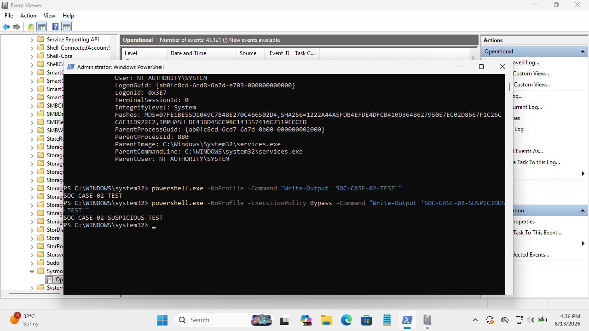
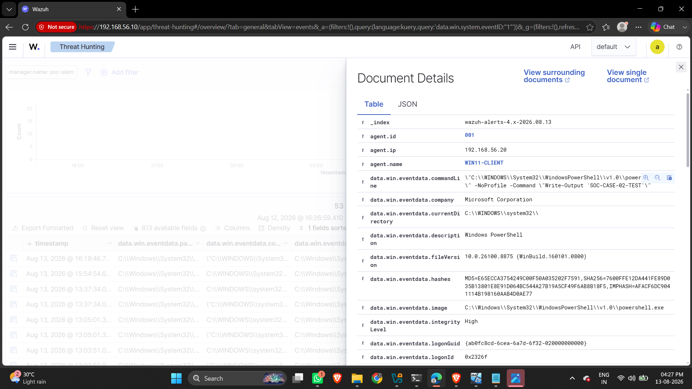

# Case 02 — Suspicious PowerShell Execution Investigation

## Case Metadata
- **Case ID**: CASE-002
- **Status**: Closed — Investigation Completed
- **Date**: 2026-08-13
- **Initial Alert Source**: Sysmon Endpoint Telemetry / Wazuh SIEM
- **Alert Description**: Execution of PowerShell with security-relevant bypass flags
- **Initial Severity**: Low to Medium

---

## Affected Asset & User Context
- **Host Name**: `WIN11-CLIENT`
- **Host IP Address**: `192.168.56.20`
- **Observed User**: System User (`WIN11-CLIENT\SOC-WIN11`)

---

## Investigation Indicators (IOCs)
- **Process Image**: `powershell.exe`
- **Path**: `C:\Windows\System32\WindowsPowerShell\v1.0\powershell.exe`
- **Execution Characteristic**: `-ExecutionPolicy Bypass`
- **Executed Test String**: `SOC-CASE-02-SUSPICIOUS-TEST`
- **Network / File Hash IOCs**: None (No external IP, domain, or malicious binary created)

---

## Telemetry & Evidence

### Evidence 1 — Sysmon Event ID 1 (Process Creation)
- **Event ID**: 1
- **Process Name**: `powershell.exe`
- **Command Line**: `powershell.exe -NoProfile -ExecutionPolicy Bypass Write-Output 'SOC-CASE-02-SUSPICIOUS-TEST'`
- **Parent Process**: `cmd.exe` / Parent Process Lineage
- **Integrity Level**: Medium / High



### Evidence 2 — Wazuh SIEM Ingestion
- **Source**: Sysmon Operational Channel forwarded by Wazuh Agent on `WIN11-CLIENT`.
- **Wazuh Dashboard Visibility**: Telemetry received and archived, alerting on execution policy override.



---

## Analyst Analysis & Workflow

1. **Alert Evaluation**: Sysmon Event ID 1 recorded the execution of `powershell.exe` configured with `-ExecutionPolicy Bypass` and `-NoProfile`.
2. **Security Flag Analysis**: The `-ExecutionPolicy Bypass` flag is a well-known command parameter frequently used by attackers to bypass administrative PowerShell execution restrictions.
3. **Payload Inspection**: Detailed inspection of the complete command string revealed the actual script logic:
   ```powershell
   Write-Output 'SOC-CASE-02-SUSPICIOUS-TEST'
   ```
4. **Follow-On Verification**: Process tree lineage and network logs were reviewed to check for download cradles (`WebClient`, `Invoke-WebRequest`), base64 encoded strings, or follow-on child process spawns (`cmd.exe`, `certutil.exe`). None were present.

---

## MITRE ATT&CK Mapping
- **Tactics**: Execution (TA0002)
- **Techniques**: [T1059.001 — Command and Scripting Interpreter: PowerShell](https://attack.mitre.org/techniques/T1059/001/)

---

## Verdict
**Suspicious Execution Parameter — Benign Test Payload**

The execution contained a security-relevant characteristic (`-ExecutionPolicy Bypass`), but the executed command was an explicit benign laboratory test marker (`SOC-CASE-02-SUSPICIOUS-TEST`). No malicious follow-on activity, payload download, or privilege escalation occurred.

---

## Impact Assessment
- **Confirmed Security Impact**: None.
- **Negative Findings**: No credential theft, persistence creation, malware execution, or network exfiltration observed.

---

## Recommendations
1. **Authorization Check**: Verify if the PowerShell command was run by an authorized administrative test script.
2. **PowerShell Logging**: Ensure PowerShell Script Block Logging (Event ID 4104) and Module Logging are enabled across endpoints to capture deep command execution.
3. **Alert Refinement**: Configure detection rules to trigger higher severity when `-ExecutionPolicy Bypass` is combined with network downloads or encoded commands (`-EncodedCommand`), rather than standalone benign strings.
