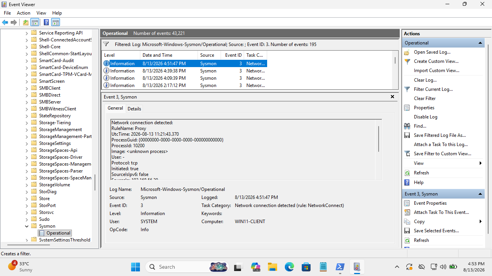
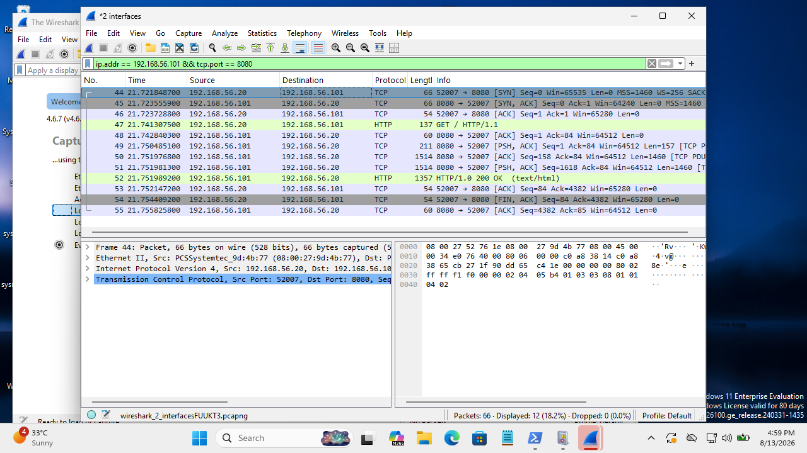

# Case 03 — Suspicious Network Activity Investigation

## Case Metadata
- **Case ID**: CASE-003
- **Status**: Closed — Investigation Completed
- **Date**: 2026-08-13
- **Initial Alert Source**: Endpoint Telemetry & Network Monitoring
- **Alert Description**: Outbound TCP network connection on non-standard port 8080
- **Initial Severity**: Low

---

## Affected Asset & Network Context
- **Source Host**: `WIN11-CLIENT`
- **Source IP**: `192.168.56.20`
- **Destination Host**: Kali Linux Test Server
- **Destination IP**: `192.168.56.101`
- **Destination Port**: `8080` (TCP)
- **Application Protocol**: HTTP

---

## Network Indicators (IOCs)
- **Source Tuple**: `192.168.56.20`
- **Destination Tuple**: `192.168.56.101:8080`
- **Protocol**: TCP / HTTP
- **Environment Context**: Controlled lab network (`192.168.56.0/24`)

---

## Telemetry & Evidence Correlation

### Evidence 1 — Sysmon Event ID 3 (Network Connection)
- **Event ID**: 3 (Network connection detected)
- **Image**: Endpoint process initiating outbound connection
- **Source IP**: `192.168.56.20`
- **Destination IP**: `192.168.56.101`
- **Destination Port**: `8080`
- **Protocol**: TCP



### Evidence 2 — Wazuh Manager Archives
- **Status**: Received and logged in Wazuh manager `archives.log` / JSON archives.
- **Alert Status**: Event was archived; no high-severity alert triggered due to lack of a custom rule flagging port 8080.

### Evidence 3 — Wireshark Packet Inspection
- **Filter**: `ip.addr == 192.168.56.101 && tcp.port == 8080`
- **Packet Details**: Valid TCP 3-way handshake followed by HTTP GET request from `192.168.56.20` to `192.168.56.101:8080`.
- **Payload Inspection**: Standard HTTP request generated during laboratory testing; no C2 beaconing pattern, shellcode, or exfiltrated data structure present.



---

## Correlation Matrix

```text
  Windows Endpoint Connection
            │
            ▼
    Sysmon Event ID 3
            │
            ▼
    Wazuh Event Archive
            │
            ▼
    Wireshark Packet Analysis (TCP / HTTP Handshake)
            │
            ▼
    Independent Corroboration of Traffic
```

---

## MITRE ATT&CK Mapping
- **Tactics**: Command and Control (TA0109) / Exfiltration (TA0104) — *Evaluated*
- **Mapping Verdict**: No MITRE ATT&CK technique assigned because the traffic was verified as benign laboratory traffic without malicious intent or C2 payload.

---

## Verdict
**Benign — Controlled Network Activity**

Network communication from `192.168.56.20` to `192.168.56.101:8080` was intentionally generated as part of a SOC lab protocol test. Packet inspection confirmed standard HTTP traffic without malicious C2 signatures or exfiltration.

---

## Impact Assessment
- **Confirmed Impact**: None.
- **Scope**: Activity confined strictly to the isolated SOC laboratory virtual adapter.

---

## Recommendations
1. **Correlate Process & Network Data**: Always match Sysmon Event ID 3 (Network Connection) with Sysmon Event ID 1 (Process Creation) using Process ID / Process GUID to identify which process initiated the connection.
2. **SIEM Rule Tuning**: Author custom Wazuh detection rules targeting unencrypted outbound connections on non-standard HTTP ports (e.g. 8080, 8443, 4444) from endpoint hosts.
3. **Packet Capture Utilization**: Utilize Wireshark packet analysis whenever endpoint logs leave ambiguity regarding application-layer traffic intent.
