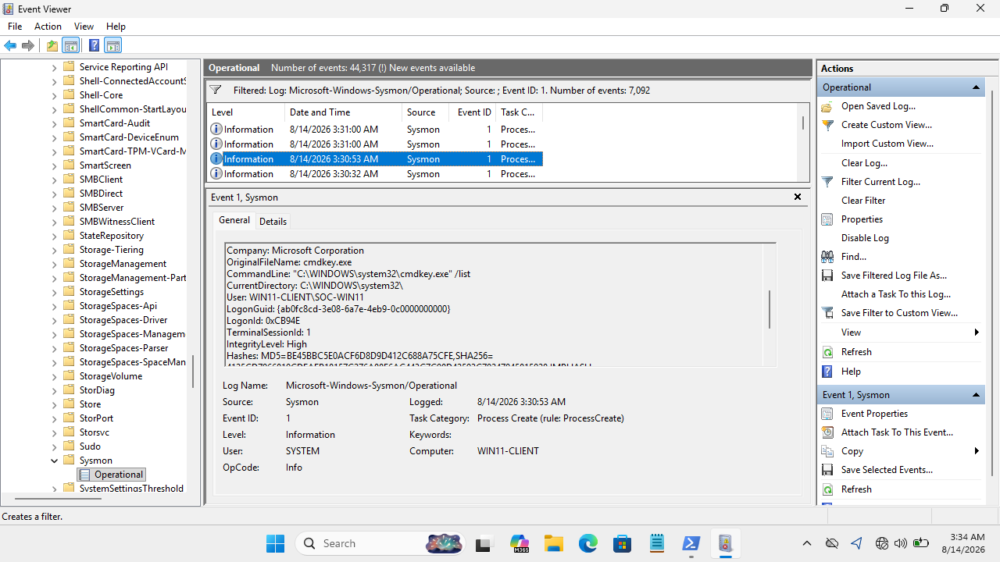

# Case 04 — Credential Access Behavior Investigation

## Case Metadata
- **Case ID**: CASE-004
- **Status**: Closed — Investigation Completed
- **Date**: 2026-08-13
- **Initial Alert Source**: Sysmon Endpoint Process Creation Telemetry
- **Alert Description**: Command-line execution of `cmdkey.exe` with `/list` enumeration flag
- **Initial Severity**: Medium

---

## Affected Asset & User Context
- **Host Name**: `WIN11-CLIENT`
- **Host IP Address**: `192.168.56.20`
- **Observed User**: `WIN11-CLIENT\SOC-WIN11`
- **Target Credential Store**: Windows Credential Manager

---

## Investigation Indicators & Telemetry (Sysmon Event ID 1)

- **Process Image**: `C:\Windows\System32\cmdkey.exe`
- **Executed Command Line**: `"C:\WINDOWS\system32\cmdkey.exe" /list`
- **Process ID (PID)**: `532`
- **Process GUID**: `{ab0fc8cd-447b-6a7e-4b02-000000002400}`
- **Parent Process Image**: `C:\Windows\System32\WindowsPowerShell\v1.0\powershell.exe`
- **Parent Command Line**: `C:\Windows\System32\WindowsPowerShell\v1.0\powershell.exe`
- **Parent Process ID (PPID)**: `4060`
- **Integrity Level**: `High`
- **Timestamp**: `2026-08-13 22:26:03.604 UTC`



---

## Analyst Analysis & Workflow

1. **Telemetry Capture**: Sysmon Event ID 1 recorded the execution of `cmdkey.exe` on `WIN11-CLIENT`.
2. **Process Chain Analysis**:
   ```text
   PowerShell (PID 4060)
         │
         ▼
   cmdkey.exe (PID 532)
         │
         ▼
   /list (Enumerates Windows Credential Manager Entries)
   ```
3. **Behavioral Evaluation**: The `/list` argument instructs `cmdkey.exe` to display cached credentials, domain passwords, and smart card credentials saved in the Windows Credential Manager. Threat actors commonly use this native utility for credential discovery prior to lateral movement.
4. **Wazuh Dashboard Visibility Note**: During investigation, this specific Sysmon Event ID 1 was captured in local Sysmon logs, but was not rendered in the active Wazuh SIEM view due to log filtering configuration. Local Sysmon log extraction provided the authoritative evidence.
5. **Account Attributions**: The process executed under `WIN11-CLIENT\SOC-WIN11` with High Integrity. Evidence did *not* show execution by the `soc-test` account.
6. **Data Loss Assessment**: While the enumeration command executed successfully, available logs do not show password extraction, credential dumping, or exfiltration of credential secrets.

---

## MITRE ATT&CK Mapping
- **Tactics**: Credential Access (TA0006) / Discovery (TA0007)
- **Techniques**: [T1555.004 — Credentials from Password Stores: Windows Credential Manager](https://attack.mitre.org/techniques/T1555/004/)

---

## Verdict
**Suspicious Credential-Access Behavior — Credential Theft Not Confirmed**

The investigation confirmed that `cmdkey.exe /list` was executed via PowerShell to list Windows Credential Manager targets. However, empirical evidence does *not* prove that passwords were disclosed, dumped, or exfiltrated. The event is classified as suspicious credential discovery behavior.

---

## Impact Assessment
- **Confirmed Exposure**: Credential store target names enumerated.
- **Unconfirmed / Negative Findings**: No evidence of plain-text password extraction, memory dumping (LSASS), or outbound transmission.

---

## Recommendations
1. **Investigate Parent PowerShell Session**: Trace parent process PID 4060 to determine how PowerShell was launched and what commands preceded `cmdkey.exe`.
2. **Monitor `cmdkey.exe` Executions**: Create explicit endpoint detection rules for `cmdkey.exe` with parameters `/list`, `/generic`, or `/add`.
3. **Enhance SIEM Ingestion**: Update Wazuh XML ruleset and Sysmon eventchannel configuration to ensure all Event ID 1 instances of credential utilities are indexed and alerted on.
4. **Privilege Review**: Review user `SOC-WIN11` permissions and check for subsequent process spawns or lateral network connections.
