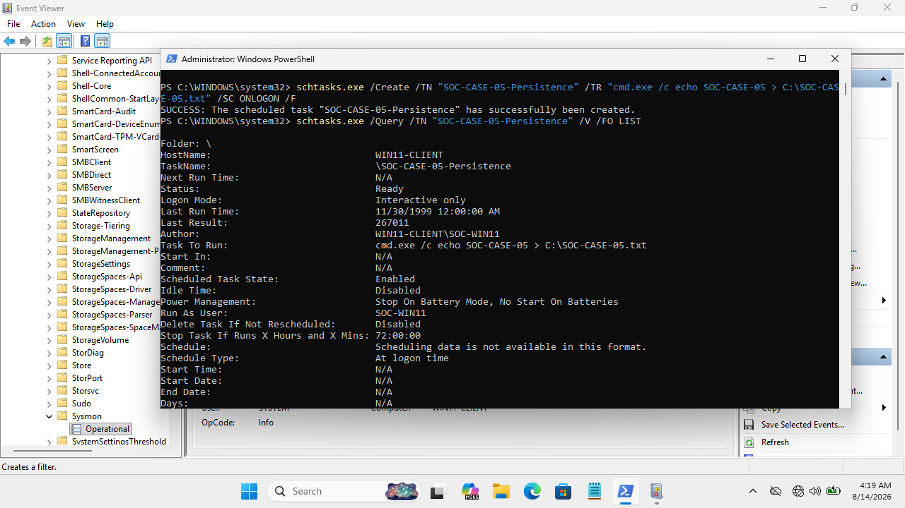
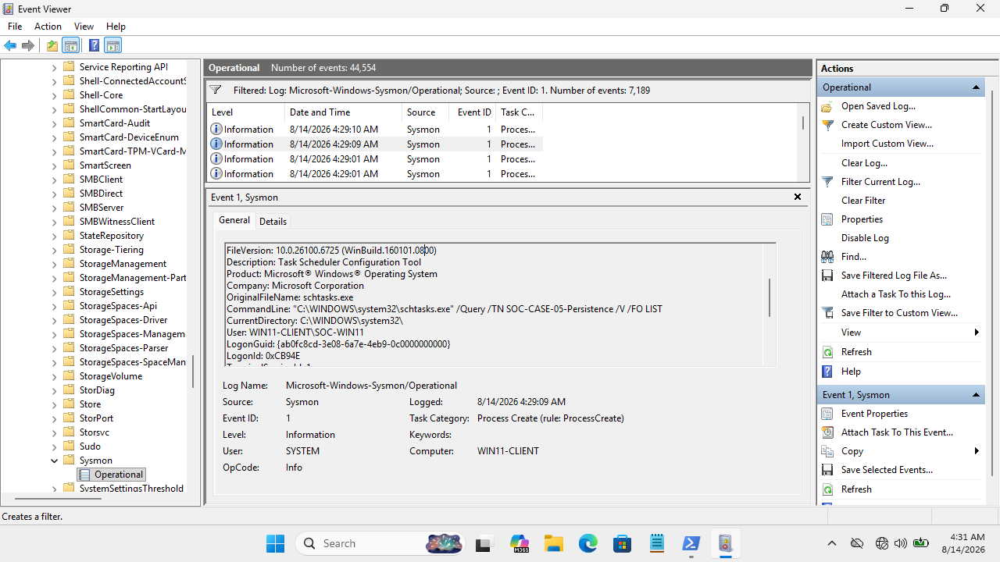
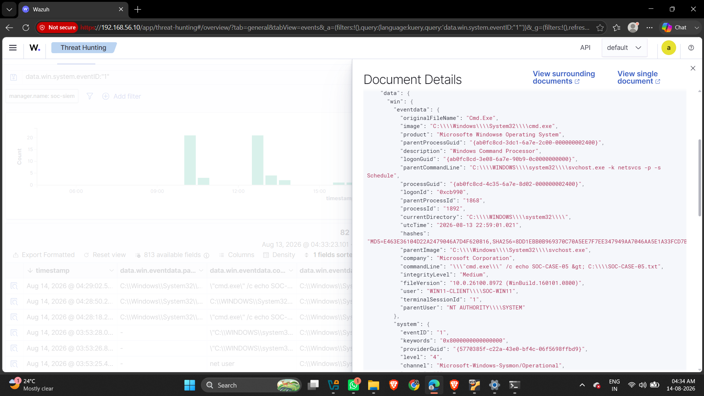

# Case 05 — Scheduled Task Persistence Investigation

## Case Metadata
- **Case ID**: CASE-005
- **Status**: Closed — Investigation Completed
- **Date**: 2026-08-13
- **Initial Alert Source**: Task Scheduler Logs / Sysmon Event ID 1 / Wazuh SIEM
- **Alert Description**: Creation and logon-trigger execution of a scheduled task
- **Initial Severity**: Medium

---

## Affected Asset & User Context
- **Host Name**: `WIN11-CLIENT`
- **Host IP Address**: `192.168.56.20`
- **Observed User**: `WIN11-CLIENT\SOC-WIN11`

---

## Persistence Indicators & Task Configuration

- **Task Name**: `SOC-CASE-05-Persistence`
- **Full Path**: `\SOC-CASE-05-Persistence`
- **Schedule Type**: At logon (`ONLOGON`)
- **Task Status**: Ready / Enabled
- **Run As User Account**: `SOC-WIN11`
- **Configured Action**: `cmd.exe /c echo SOC-CASE-05 > C:\SOC-CASE-05.txt`



---

## Telemetry & Evidence Analysis

### Evidence 1 — Scheduled Task Query Verification
Querying `schtasks.exe` confirmed the persistent task configuration:
- Status: Ready
- Trigger: At logon
- Action: `cmd.exe /c echo SOC-CASE-05 > C:\SOC-CASE-05.txt`

### Evidence 2 — Sysmon Event ID 1 (Process Execution Lineage)
- **Image**: `C:\Windows\System32\cmd.exe`
- **Command Line**: `"cmd.exe" /c echo SOC-CASE-05 > C:\SOC-CASE-05.txt`
- **User**: `WIN11-CLIENT\SOC-WIN11`
- **Parent Image**: `C:\Windows\System32\svchost.exe`
- **Parent Command Line**: `C:\WINDOWS\system32\svchost.exe -k netsvcs -p -s Schedule`



### Evidence 3 — Wazuh SIEM Alert
- **Wazuh Rule ID**: `92052`
- **Rule Severity**: Level 4
- **Rule Description**: *Windows command prompt started by an abnormal process*
- **Wazuh Event Data**: Recorded `cmd.exe` with parent `svchost.exe` (Task Scheduler service).
- **Wazuh ATT&CK Mapping**: T1059.003 (Windows Command Shell)



---

## Process Correlation & Execution Chain

```text
       Scheduled Task Registered (\SOC-CASE-05-Persistence)
                               │
                               ▼
                   User Logon Event Trigger
                               │
                               ▼
      Windows Task Scheduler Service (svchost.exe -s Schedule)
                               │
                               ▼
                cmd.exe Process Creation (Sysmon Event ID 1)
                               │
                               ▼
               Wazuh SIEM Detection (Rule 92052, Level 4)
```

---

## MITRE ATT&CK Mapping
- **Tactics**: Persistence (TA0003) / Execution (TA0002)
- **Techniques**:
  - [T1053.005 — Scheduled Task/Job: Scheduled Task](https://attack.mitre.org/techniques/T1053/005/)
  - [T1059.003 — Command and Scripting Interpreter: Windows Command Shell](https://attack.mitre.org/techniques/T1059/003/)

---

## Verdict
**Confirmed Scheduled Task Persistence Mechanism — Benign Laboratory Activity**

A scheduled task configured to execute automatically at user logon was successfully registered and executed on `WIN11-CLIENT`. The process lineage confirmed invocation through the Task Scheduler service (`svchost.exe -s Schedule`). The mechanism represents a genuine persistence technique, but the payload (`echo SOC-CASE-05 > C:\SOC-CASE-05.txt`) was benign.

---

## Impact Assessment
- **Confirmed Security Impact**: None (Harmless test payload).
- **Technique Validation**: Validated end-to-end detection of Windows Task Scheduler persistence using Sysmon and Wazuh.

---

## Recommendations
1. **Auditing Scheduled Tasks**: Periodically audit registered scheduled tasks via PowerShell (`Get-ScheduledTask`) or SIEM alerting.
2. **Focus on Task Parents**: Alert on `cmd.exe`, `powershell.exe`, or `wscript.exe` processes where the parent image is `svchost.exe` (Task Scheduler service) or `taskhostw.exe`.
3. **Inspect Task Locations & Actions**: Flag scheduled tasks pointing to temp folders (`C:\Users\...\AppData\Local\Temp`), user writeable directories, or containing encoded script parameters.
4. **Remediation**: Delete unauthorized persistence tasks using `schtasks /delete /tn "SOC-CASE-05-Persistence" /f`.
