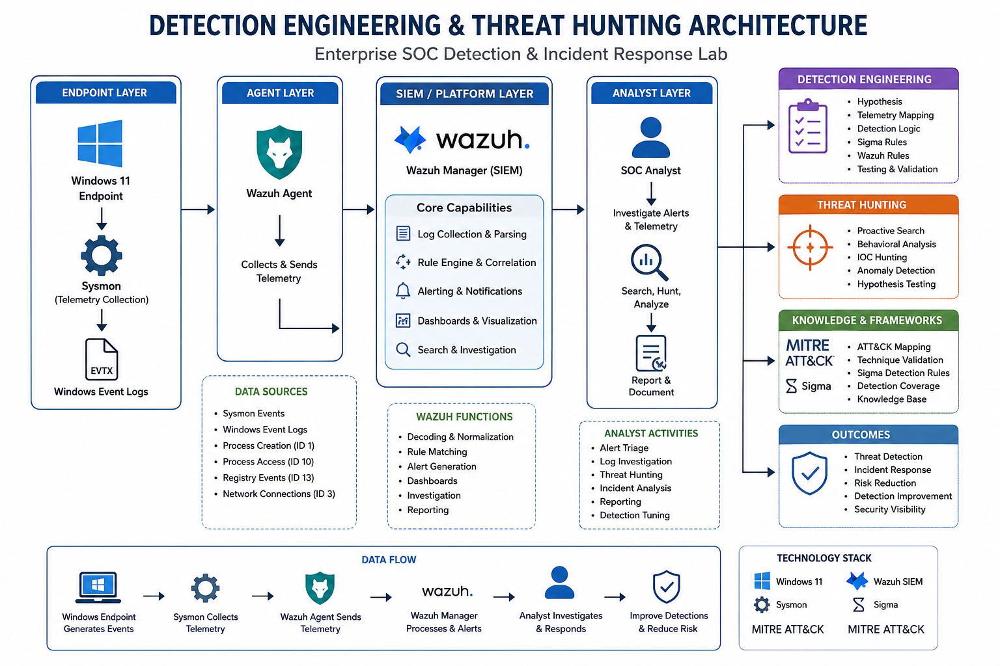
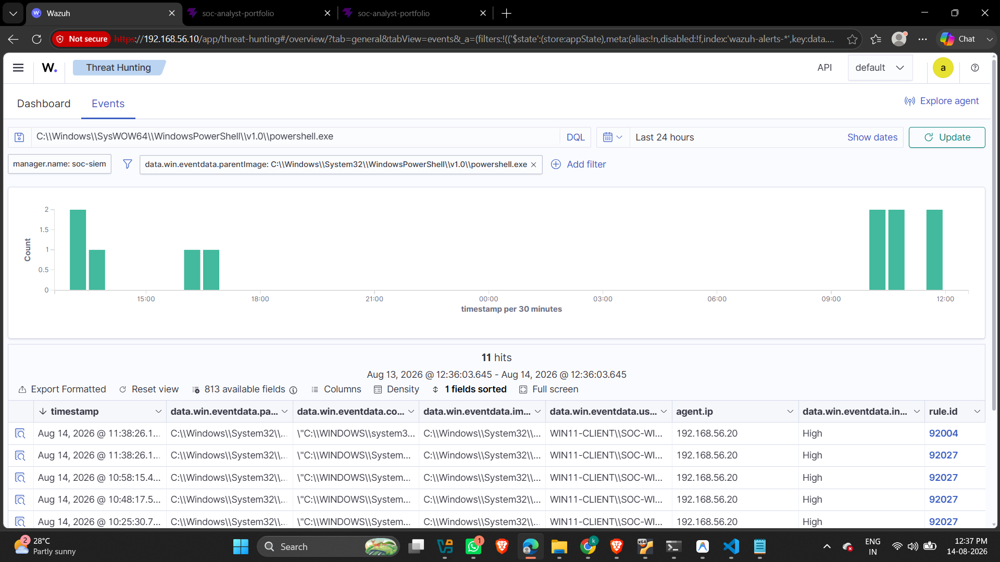
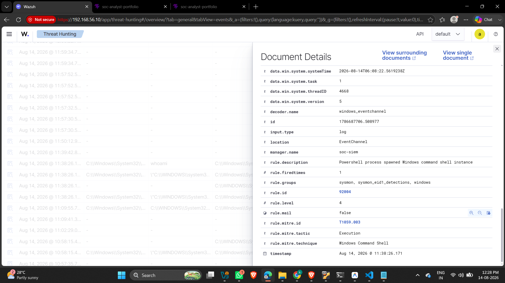
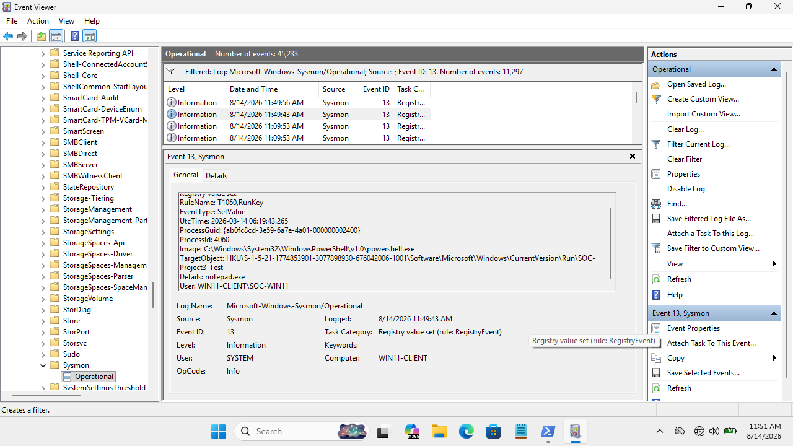

# Enterprise SOC Detection & Incident Response Lab

> **Detection Engineering • Threat Hunting • SIEM • Windows Security**  
> An end-to-end SOC detection engineering lab focused on Windows endpoint telemetry, behavioral detection development, MITRE ATT&CK mapping, threat hunting, false-positive analysis, and detection tuning.

---

## 1. Executive Summary

This project demonstrates an **enterprise-style SOC detection engineering and threat hunting framework** using Windows endpoint telemetry, Sysmon, Wazuh SIEM, Sigma detection rules, and MITRE ATT&CK mapping. 

The lab focuses on authoring behavioral detections, validating endpoint telemetry, investigating security events across process creation and registry modifications, tuning rules to reduce false positives, and conducting proactive threat hunting.

```text
  Windows 11 Endpoint
       │
       ▼
  Sysmon Instrumentation ─► (Event ID 1, 3, 10, 13)
       │
       ▼
  Wazuh Agent Forwarding
       │
       ▼
  Wazuh SIEM Ingestion
       │
       ▼
  SOC Analyst Review ─────► Detection Engineering & Threat Hunting
       │                         │
       │                         ├─► Sigma & Wazuh Rules
       │                         ├─► MITRE ATT&CK Mapping
       │                         ├─► False-Positive Analysis
       │                         └─► Detection Tuning & Iteration
       ▼
  Improved Actionable Security Signal
```

---

## 2. Key Project Metrics

- **6 Detection Scenarios**: DET-001 (PowerShell), DET-002 (PowerShell -> CMD), DET-003 (Suspicious Process Tree), DET-004 (Registry Run Key Persistence), DET-005 (LSASS Memory Access), DET-006 (Outbound Network Connection).
- **4+ Sysmon Event Types**: Event ID 1 (Process Creation), Event ID 3 (Network Connection), Event ID 10 (Process Access), Event ID 13 (Registry Value Set).
- **6 Vendor-Neutral Sigma Rules**: Standardized detection rules authored for cross-SIEM deployment.
- **4 MITRE ATT&CK Techniques**: Mapped strictly based on empirical telemetry (T1059.001, T1059.003, T1547.001, T1003.001).
- **Proactive Threat Hunting**: Hypothesis-driven hunts across process lineage, registry persistence, and network traffic.
- **False-Positive Analysis**: Rigorous tuning logic to separate administrative activity from suspicious behavior.

---

## 3. Detection Engineering Architecture



```text
                    ┌─────────────────────┐
                    │   Security Analyst  │
                    └──────────┬──────────┘
                               │
                         Investigation
                               │
                    ┌──────────▼──────────┐
                    │        Wazuh        │
                    │         SIEM        │
                    └──────────┬──────────┘
                               │
                         Alert / Search
                               │
                    ┌──────────▼──────────┐
                    │    Wazuh Agent      │
                    └──────────┬──────────┘
                               │
                    ┌──────────▼──────────┐
                    │      Windows        │
                    │      Endpoint       │
                    └──────────┬──────────┘
                               │
                    ┌──────────▼──────────┐
                    │       Sysmon        │
                    │      Telemetry      │
                    └─────────────────────┘

             Detection Engineering
                       │
       ┌───────────────┼────────────────┐
       ▼               ▼                ▼
     Sigma           Wazuh          MITRE ATT&CK
       │             Rules               │
       └───────────────┼─────────────────┘
                       ▼
                Detection Testing
                       │
                       ▼
                Threat Hunting
                       │
                       ▼
              FP Analysis & Tuning
```

### Architecture Data Flow:
1. **Windows 11 Endpoint**: Primary victim system generating native Windows Security events.
2. **Sysmon Telemetry**: Captures granular process creation, registry value sets, process access, and network connections.
3. **Wazuh Agent**: Securely forwards endpoint logs to the centralized manager.
4. **Wazuh SIEM Manager & Dashboard**: Parses events, matches detection rules, and provides analyst query capability.
5. **SOC Analyst**: Conducts behavioral investigation, authors Sigma detection logic, maps MITRE ATT&CK, and performs tuning.

---

## 4. Detection Coverage Matrix

| ID | Detection Name | Telemetry Source | MITRE ATT&CK | Tactic | Validation Status |
|---|---|---|---|---|---|
| **[DET-001](./detections/DET-001-PowerShell.md)** | Suspicious PowerShell Execution | Sysmon Event ID 1 | `T1059.001` | Execution | Telemetry Validated |
| **[DET-002](./detections/DET-002-Command-and-Scripting.md)** | PowerShell Spawning CMD (`whoami`) | Sysmon Event ID 1 | `T1059.003` | Execution | Telemetry Validated |
| **[DET-003](./detections/DET-003-Suspicious-Process.md)** | Suspicious Process Tree Behavior | Sysmon Event ID 1 | Behavioral | Execution | Telemetry Validated |
| **[DET-004](./detections/DET-004-Persistence.md)** | Registry Run Key Modification | Sysmon Event ID 13 | `T1547.001` | Persistence | Telemetry Validated |
| **[DET-005](./detections/DET-005-Credential-Access.md)** | LSASS Process Memory Access | Sysmon Event ID 10 | `T1003.001` | Credential Access | Telemetry Validated |
| **[DET-006](./detections/DET-006-Suspicious-Network.md)** | Outbound Network Connection | Sysmon Event ID 3 | Context-Dependent | Investigation Signal | Telemetry Validated |

---

## 5. Detection Cards Summary

### DET-001 — Suspicious PowerShell Execution
- **Summary**: Detects suspicious PowerShell execution using process creation telemetry and command-line parameters (`-ExecutionPolicy Bypass`, `-NoProfile`).
- **Telemetry**: Sysmon Event ID 1 (`Image = powershell.exe`)
- **MITRE**: `T1059.001 — PowerShell`

### DET-002 — PowerShell Spawning Command Shell
- **Summary**: Identifies suspicious process chain where `powershell.exe` spawns `cmd.exe` executing system discovery commands (`whoami`).
- **Telemetry**: Sysmon Event ID 1 (`ParentImage = powershell.exe`, `Image = cmd.exe`)
- **MITRE**: `T1059.003 — Windows Command Shell`

### DET-003 — Suspicious Process Tree Analysis
- **Summary**: Monitors anomalous parent-child process relationships and execution arguments across Windows process creation logs.
- **Telemetry**: Sysmon Event ID 1 (Process Tree & Image Path)
- **MITRE**: Behavioral Execution Analysis

### DET-004 — Registry Run Key Persistence
- **Summary**: Detects modifications to Windows Registry Run keys (`HKCU\Software\Microsoft\Windows\CurrentVersion\Run`) used for logon persistence.
- **Telemetry**: Sysmon Event ID 13 (`TargetObject` matching `CurrentVersion\Run`)
- **MITRE**: `T1547.001 — Registry Run Keys / Startup Folder`

### DET-005 — LSASS Process Memory Access
- **Summary**: Tracks process handles opened against `lsass.exe` to identify potential credential dumping activity.
- **Telemetry**: Sysmon Event ID 10 (`TargetImage = C:\Windows\System32\lsass.exe`)
- **MITRE**: `T1003.001 — LSASS Memory`

### DET-006 — Outbound Network Activity Investigation
- **Summary**: Investigates outbound TCP network connections on non-standard ports initiated by endpoint processes.
- **Telemetry**: Sysmon Event ID 3 (`DestinationIp`, `DestinationPort`, `Image`)
- **MITRE**: Context-Dependent Network Investigation

---

## 6. SOC Investigation Evidence Gallery

### Wazuh SIEM Architecture & Threat Hunting


### MITRE ATT&CK Coverage Map


### DET-001: PowerShell Execution Telemetry (Sysmon Event ID 1)


### DET-003: Suspicious Process Creation in Wazuh


### DET-004: Registry Persistence Detection


### DET-005: LSASS Process Access Evidence


---

## 7. Threat Hunting Methodology & Workflow

Threat hunting in this lab is hypothesis-driven and behavioral, following an 8-stage lifecycle:

```text
  1. Hypothesis Development ──► (Formulate threat scenario based on ATT&CK)
       │
       ▼
  2. Telemetry Identification ─► (Determine required Sysmon Event IDs)
       │
       ▼
  3. Query Crafting ──────────► (PowerShell Get-WinEvent & Wazuh DQL)
       │
       ▼
  4. Investigation ───────────► (Analyze process tree, SID, command line)
       │
       ▼
  5. Validation ──────────────► (Distinguish admin tasks from threats)
       │
       ▼
  6. Finding ─────────────────► (Document findings and true indicators)
       │
       ▼
  7. Detection Improvement ───► (Refine rules & tune out noise)
```

### Documented Threat Hunts:
- **PowerShell Hunting**: Searching for encoded commands, execution policy overrides, and download cradles.
- **Suspicious Process Hunting**: Tracing unexpected parent-child relationships (`powershell.exe` -> `cmd.exe`).
- **Persistence Hunting**: Auditing Registry Run keys (`HKCU\...\CurrentVersion\Run`) for unauthorized executables.
- **Credential Access Hunting**: Querying Sysmon Event ID 10 for process access to `lsass.exe`.
- **Network Hunting**: Inspecting outbound TCP connections to external test IPs.

---

## 8. False Positive Analysis & Detection Tuning

> **Core Detection Engineering Principle**:  
> `Behavior + Context + Correlation > Single-field detection`

Single-field matching creates excessive noise and analyst fatigue. The tuning logic developed in this lab addresses common false-positive scenarios:

| Detection Scenario | Potential False Positive | Tuned Detection Filter / Rule Context |
|---|---|---|
| **DET-001 (PowerShell)** | IT admin automation scripts | Require `-ExecutionPolicy Bypass` or encoded commands rather than alerting on `powershell.exe` alone. |
| **DET-002 (PowerShell -> CMD)** | Legitimate administrative batch files | Correlate `ParentImage` (`powershell.exe`) with `Image` (`cmd.exe`) and command arguments (`whoami`). |
| **DET-003 (Registry)** | Legitimate app installers (Edge auto-start) | Inspect `TargetObject` value data and modifying image path (`HKCU\...\Run\SOC-Project3-Test = notepad.exe`). |
| **DET-004 (LSASS Access)** | Windows OS services (`svchost.exe`) | Filter expected `SourceUser` (`NT AUTHORITY\SYSTEM`), evaluate `GrantedAccess` rights and `CallTrace`. |
| **DET-005 (Network)** | OneDrive cloud sync (`OneDrive.Sync.Service.exe`) | Combine `Image` binary name with destination IP, port, and connection frequency. |

---

## 9. Vendor-Neutral Sigma Detection Rules

The project contains 6 production-ready, vendor-neutral **Sigma detection rules** authored in YAML format:

- `DET-001-PowerShell.yml`
- `DET-002-Command-and-Scripting.yml`
- `DET-003-Suspicious-Process.yml`
- `DET-004-Persistence.yml`
- `DET-005-Credential-Access.yml`
- `DET-006-Suspicious-Network.yml`

*Note: Full Sigma YAML rules can be inspected in the technical repository or expandable rule sections.*

---

## 10. MITRE ATT&CK Mapping & Defensive Discipline

Observed behaviors are mapped strictly to MITRE ATT&CK techniques when empirical telemetry exists:

- **T1059.001** — Command and Scripting Interpreter: PowerShell
- **T1059.003** — Command and Scripting Interpreter: Windows Command Shell
- **T1547.001** — Boot or Logon Autostart Execution: Registry Run Keys / Startup Folder
- **T1003.001** — OS Credential Dumping: LSASS Memory

*Defensive Discipline Note*: Network detection **DET-006** is not assigned a specific C2 technique because observed outbound traffic alone does not prove command-and-control. Refusing to force unsupported techniques demonstrates rigorous analyst discipline.

---

## 11. Key Technical Skills Demonstrated

- **SOC & SIEM Operations**: Ingesting, parsing, and searching endpoint telemetry in Wazuh SIEM.
- **Detection Engineering**: Authoring Sigma rules, defining detection logic, mapping MITRE ATT&CK, and tuning false positives.
- **Endpoint Telemetry Mastery**: Deep operational understanding of Sysmon Event IDs 1, 3, 10, and 13.
- **Threat Hunting**: Hypothesis-driven hunting across process trees, registry keys, and LSASS handles.
- **Process Lineage Tracing**: Utilizing Process ID, Parent Process ID, and image paths to trace execution context.

---

## 12. Project Learnings & Limitations

### Key Learnings:
1. **Telemetry Comes First**: Detections are only as reliable as the underlying Sysmon/Event Log instrumentation.
2. **Context Prevents Noise**: Single-field matches generate false positives; behavioral context is essential.
3. **Iterative Lifecycle**: Detection engineering requires continuous testing, false-positive analysis, and tuning.

### Honest Project Limitations:
- **Telemetry Validated vs Alert Validated**: Endpoint telemetry was successfully captured for all 6 scenarios, but custom Wazuh alert validation remains pending for select custom rule files. Maintaining this distinction prevents unsupported claims.

---

## 13. Technical Repository Link

🔗 **GitHub Repository**: [Detection Engineering & Threat Hunting Framework](https://github.com/Krishnagurme/Detection-Engineering-Threat-Hunting-Framework.git)
