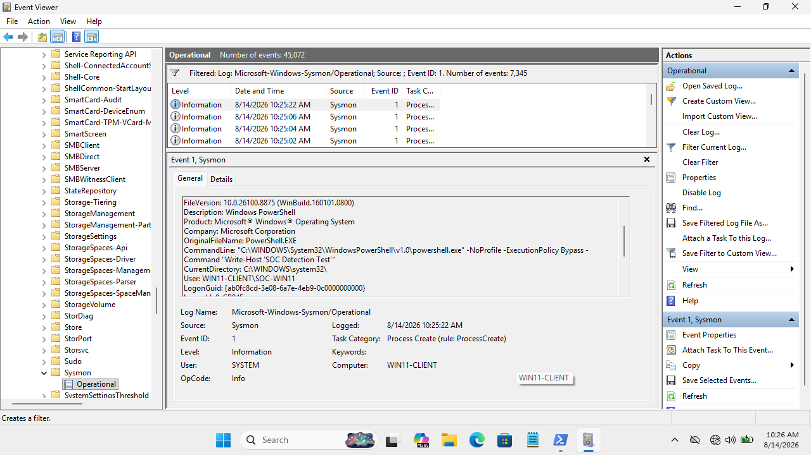

# DET-001 — Suspicious PowerShell Execution

## Detection Metadata
- **Detection ID**: DET-001
- **Title**: Suspicious PowerShell Execution Policy Bypass
- **Severity**: Medium
- **Telemetry Source**: Sysmon Operational Log
- **Sysmon Event ID**: Event ID 1 (Process Creation)
- **MITRE ATT&CK Mapping**: T1059.001 (Command and Scripting Interpreter: PowerShell)
- **Validation Status**: Telemetry Validated

---

## Detection Objective
Detect suspicious PowerShell execution using process creation telemetry, command-line arguments, and execution policy bypass flags.

---

## Telemetry & Evidence (Sysmon Event ID 1)
- **Image**: `C:\Windows\System32\WindowsPowerShell\v1.0\powershell.exe`
- **Command Line**: `powershell.exe -NoProfile -ExecutionPolicy Bypass`
- **Observed Characteristics**: `-ExecutionPolicy Bypass`, `-NoProfile`
- **Parent Process**: Interactive Command Shell / Administrative Process



---

## Sigma Detection Rule (`DET-001-PowerShell.yml`)

```yaml
title: Suspicious PowerShell Execution Policy Bypass
id: det-001-powershell-bypass
status: experimental
description: Detects powershell.exe executed with execution policy bypass flag
logsource:
    category: process_creation
    product: windows
detection:
    selection:
        Image|endswith: '\powershell.exe'
        CommandLine|contains:
            - '-ExecutionPolicy Bypass'
            - '-ep bypass'
    condition: selection
falsepositives:
    - Administrative automation scripts
    - IT deployment tools
level: medium
```

---

## False Positive Analysis & Tuning
- **False Positive Potential**: IT administration scripts and automated deployment software frequently use execution policy bypass options.
- **Tuning Consideration**: Do not classify standalone `powershell.exe` as malicious. Require secondary indicators such as encoded commands (`-EncodedCommand`), download cradles (`WebClient`), or un-privilege parent processes.
