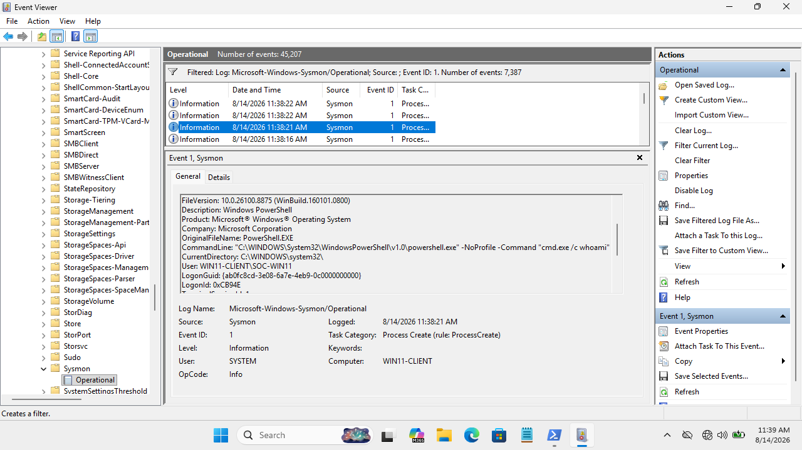
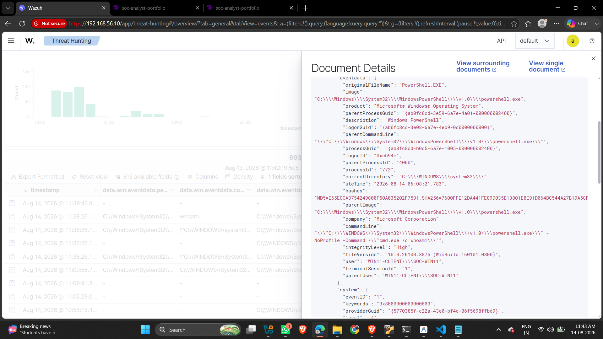

# DET-003 — Suspicious Process Tree Behavior

## Detection Metadata
- **Detection ID**: DET-003
- **Title**: Anomalous Process Creation & Process Tree Analysis
- **Severity**: Medium
- **Telemetry Source**: Sysmon Operational Log / Wazuh SIEM
- **Sysmon Event ID**: Event ID 1 (Process Creation)
- **MITRE ATT&CK Mapping**: Behavioral Execution Analysis
- **Validation Status**: Telemetry Validated

---

## Detection Objective
Monitor anomalous parent-child process relationships and execution arguments across Windows process creation logs.

---

## Telemetry & Evidence (Sysmon Event ID 1)
- **Image**: Process binary under review
- **Parent Image**: Originating parent binary
- **Command Line**: Full process arguments
- **User SID / Account**: Execution context




---

## Sigma Detection Rule (`DET-003-Suspicious-Process.yml`)

```yaml
title: Suspicious Process Tree Activity
id: det-003-suspicious-process-tree
status: experimental
description: Detects unusual parent-child process execution patterns
logsource:
    category: process_creation
    product: windows
detection:
    selection:
        ParentImage|endswith:
            - '\powershell.exe'
            - '\cmd.exe'
            - '\wscript.exe'
        Image|endswith:
            - '\whoami.exe'
            - '\net.exe'
            - '\systeminfo.exe'
    condition: selection
falsepositives:
    - Administrative diagnostics scripts
level: medium
```

---

## False Positive Analysis & Tuning
- **False Positive Potential**: Diagnostic scripts executed by local IT support.
- **Tuning Consideration**: Utilize process ancestry, User SIDs, and parent command-line arguments to establish baseline context before escalating alerts.
