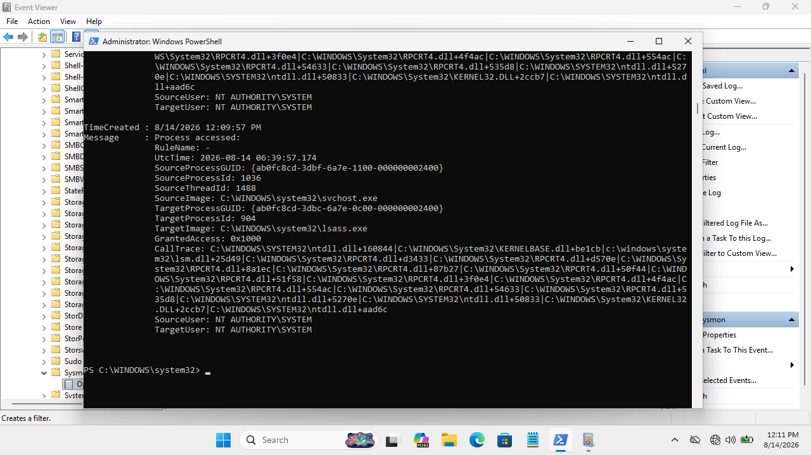

# DET-005 — LSASS Process Memory Access

## Detection Metadata
- **Detection ID**: DET-005
- **Title**: Process Access Handle Opened to LSASS
- **Severity**: Medium to High
- **Telemetry Source**: Sysmon Operational Log
- **Sysmon Event ID**: Event ID 10 (Process Access)
- **MITRE ATT&CK Mapping**: T1003.001 (OS Credential Dumping: LSASS Memory)
- **Validation Status**: Telemetry Validated

---

## Detection Objective
Track processes opening access handles against `lsass.exe` to identify potential credential harvesting or memory dumping activity.

---

## Telemetry & Evidence (Sysmon Event ID 10)
- **Event ID**: 10 (ProcessAccess)
- **Source Image**: `C:\Windows\System32\svchost.exe` (or investigative test process)
- **Target Image**: `C:\Windows\System32\lsass.exe`
- **Granted Access**: Access rights bitmask
- **Call Trace**: Stack call trace



---

## Sigma Detection Rule (`DET-005-Credential-Access.yml`)

```yaml
title: Process Access Handle Opened to LSASS
id: det-005-lsass-process-access
status: experimental
description: Detects handles opened against lsass.exe for potential credential access
logsource:
    category: process_access
    product: windows
detection:
    selection:
        TargetImage|endswith: '\lsass.exe'
    filter_legitimate:
        SourceImage|endswith:
            - '\svchost.exe'
            - '\csrss.exe'
    condition: selection and not filter_legitimate
falsepositives:
    - Legitimate Windows system processes and endpoint security agents
level: high
```

---

## False Positive Analysis & Tuning
- **False Positive Potential**: Native OS services (`svchost.exe`, `csrss.exe`) and legitimate antivirus/EDR agents routinely access LSASS.
- **Tuning Consideration**: Do not alert solely on `TargetImage = lsass.exe`. Correlate `SourceImage`, `GrantedAccess` masks (`0x1010`, `0x1F0FFF`), `SourceUser`, and `CallTrace` modules.
