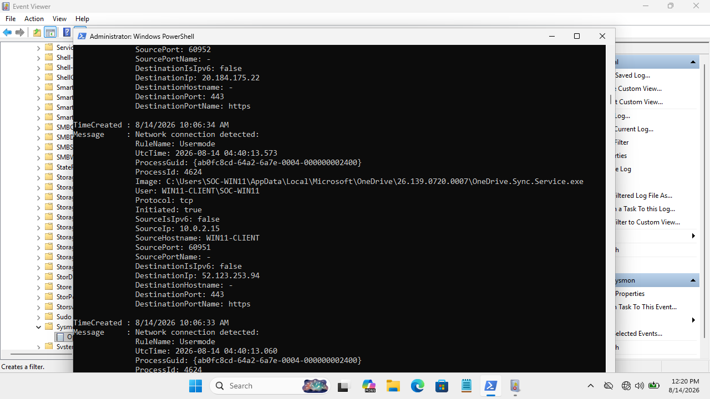

# DET-006 — Outbound Network Connection Investigation

## Detection Metadata
- **Detection ID**: DET-006
- **Title**: Outbound Network Connection Telemetry
- **Severity**: Low (Investigation Signal)
- **Telemetry Source**: Sysmon Operational Log
- **Sysmon Event ID**: Event ID 3 (Network Connection)
- **MITRE ATT&CK Mapping**: Context-Dependent Network Investigation
- **Validation Status**: Telemetry Validated

---

## Detection Objective
Investigate outbound TCP network connections on non-standard ports initiated by endpoint processes.

---

## Telemetry & Evidence (Sysmon Event ID 3)
- **Event ID**: 3 (Network connection detected)
- **Image**: Process initiating the connection
- **Source IP**: `192.168.56.20`
- **Destination IP**: `192.168.56.101`
- **Destination Port**: `8080`
- **Protocol**: TCP



---

## Sigma Detection Rule (`DET-006-Suspicious-Network.yml`)

```yaml
title: Outbound TCP Connection to Non-Standard Port
id: det-006-outbound-network
status: experimental
description: Detects outbound network connections to non-standard HTTP/C2 ports
logsource:
    category: network_connection
    product: windows
detection:
    selection:
        DestinationPort:
            - 8080
            - 8443
            - 4444
    condition: selection
falsepositives:
    - Internal web proxy servers, development HTTP services, cloud sync tools
level: low
```

---

## False Positive Analysis & Tuning
- **False Positive Potential**: Web browser background traffic, cloud sync software (`OneDrive.Sync.Service.exe`), and internal web proxy proxies generate frequent outbound traffic.
- **Tuning Consideration**: Outbound network connections require process, destination IP, port, frequency, and user context. Generic network connections are treated as investigation triggers rather than automatic malicious alerts.
